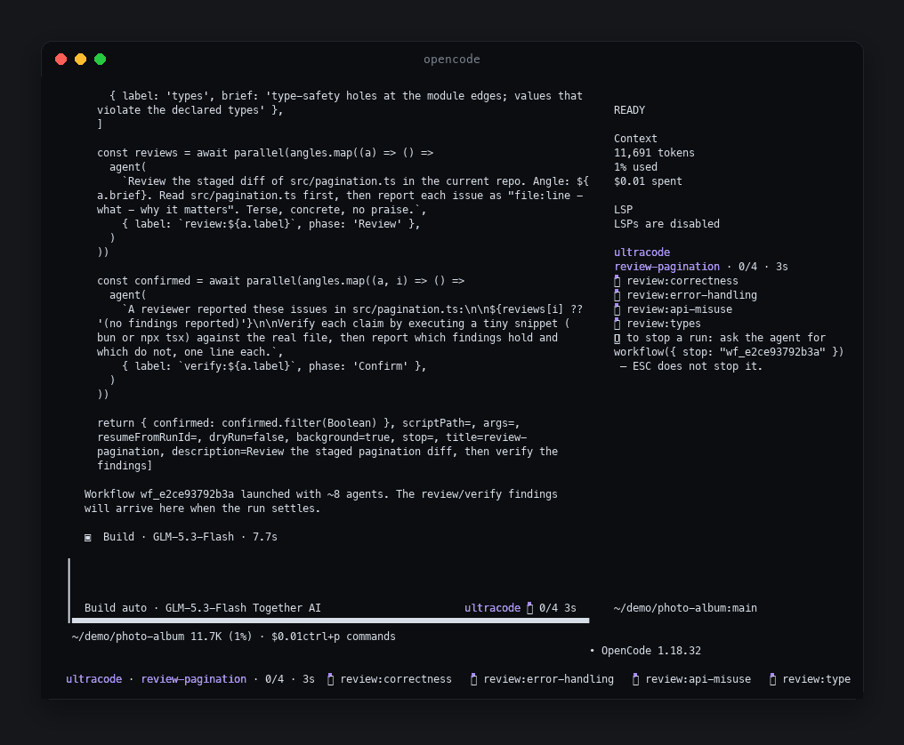
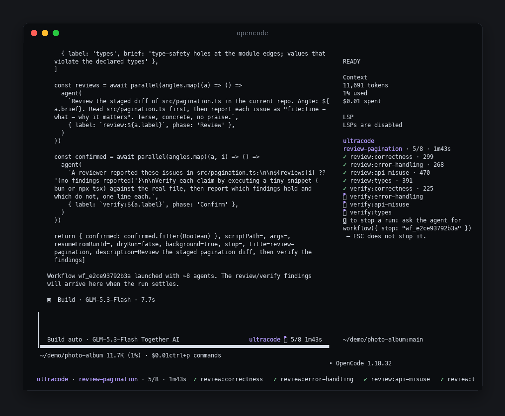
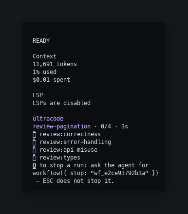
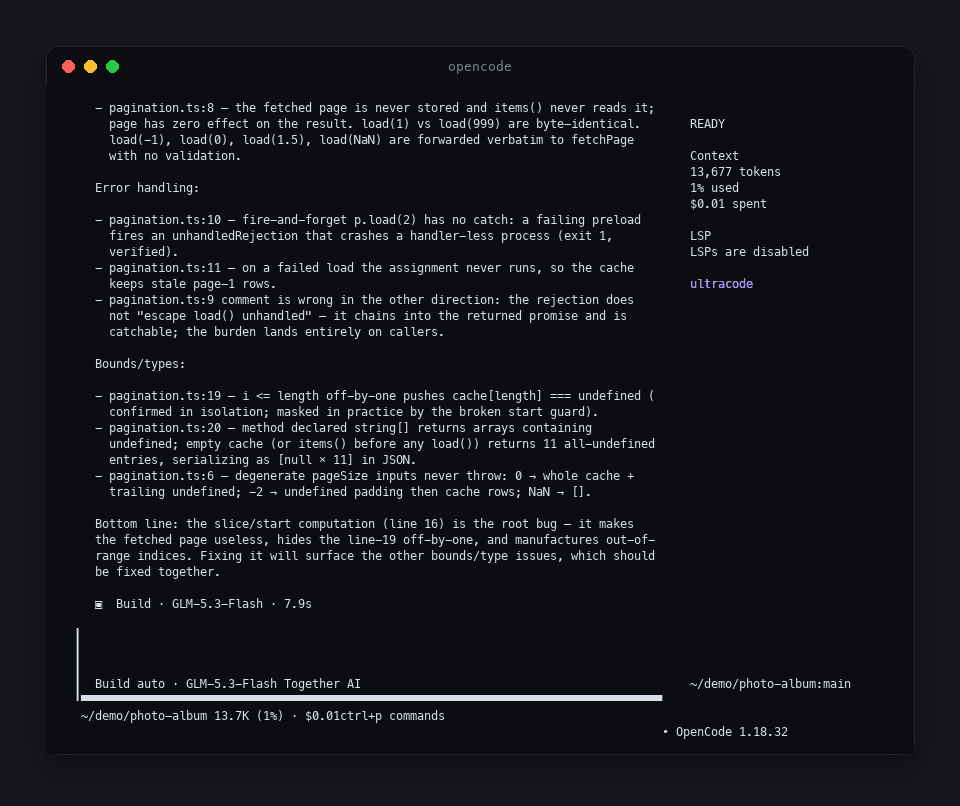

<div align="center">


# ultraopen

Deterministic multi-agent workflow orchestration and an `ultracode` effort mode for
[opencode](https://github.com/anomalyco/opencode) — the open-source AI coding agent that runs in
your terminal.

[](https://github.com/PhillipChaffee/ultraopen/actions/workflows/ci.yml)
[](https://coveralls.io/github/PhillipChaffee/ultraopen?branch=main)
[](https://github.com/PhillipChaffee/ultraopen/actions/workflows/security.yml)
[](https://github.com/anomalyco/opencode)

**Fan out many agents at once · validated results · resume instead of restarting**

[Install](#install) · [Authoring workflows](#authoring) · [Compatibility](#compatibility) · [Development](#development)

</div>

> [!TIP]
> **See it live.** `bash test/e2e/tui-dev.sh` starts opencode with the real TUI rendering —
> nothing here between you and the thing.

A workflow is a deterministic JavaScript driver in which `agent()` is the only nondeterministic
call. Control flow — fan-out, loops, dedup, thresholds, early exit, synthesis — is real code, so
runs are reproducible and resumable: resume a failed run and the agents that already finished
replay from the journal instead of running — and billing — again.

```javascript
export const meta = {
  name: 'review-changes',
  description: 'Review changed files across dimensions, verify each finding',
  phases: [{ title: 'Review' }, { title: 'Verify' }],
}

const results = await pipeline(
  DIMENSIONS,
  d => agent(d.prompt, { phase: 'Review', schema: FINDINGS }),
  review => parallel(review.findings.map(f => () =>
    agent(`Adversarially verify: ${f.title}`, { phase: 'Verify', schema: VERDICT })
  )),
)

return { confirmed: results.flat().filter(Boolean) }
```

<a id="how-it-works"></a>

## 🎬 What a run looks like

Real captures from the live TUI (`bash test/e2e/visual.sh` — real opencode processes, real model
calls), re-themed in presentation only.

**1. You hand the model the script; the engine fans out instantly.** Four review agents spawn
in parallel — the transcript echoes the raw `workflow` call (an upstream renderer quirk, and
exactly why the progress surfaces exist), the bottom strip gains one row per agent, the sidebar
fills in, and `ultracode ⠋ 0/4` appears beside the input.



**2. The fan-out keeps working.** Two minutes later the same run is still going — four real
review agents (real model calls, real file reads) with progress and elapsed time updating every
second.



**3. Up close: the sidebar panel.** Opened with `Ctrl-x` then `b` — one summary line per run,
one row per agent, glyphs for state.



**4. The findings come back as a value.** When the run returns, the model reports what it
confirmed — here, specific findings about a staged demo diff, from an uncaught fetch to the
off-by-one loop planted in `src/pagination.ts`.



Agents show as `⠋` running, `✓` done, `✗` failed. All three surfaces are served by one shared
poller — one directory pass per second — so having them all open costs one read. Live rendering
exists only because of a workaround for an upstream limitation: opencode 1.18.x never re-renders
external TUI plugin slots after mount (reactive expressions keep their initial value, `Show`/`For`
insertion no-ops), so the surfaces update imperatively via `node.content` + `requestRender()`
(src/tui/index.tsx documents the full constraint).

<a id="why"></a>

## 🤔 Why ultraopen

opencode can already spawn subagents. The trouble is orchestration by prompting: ask one model to
fan out and you get a nondeterministic pile of parallel turns — different every run, unreadable in
review, and lost the moment a turn stalls. ultraopen makes the fan-out a script: short enough to
read in one screen, diffable in review, and replayable after a crash.

This is not a framework. There is no DSL, no server, nothing to deploy — the orchestration layer
is plain JavaScript that runs inside the coding agent you already use.

| | Ad-hoc prompt fan-out | Orchestration frameworks | ultraopen |
| --- | --- | --- | --- |
| Orchestration lives | in the model's head | a graph DSL plus a server | plain JS, inside your agent |
| Runs are reproducible | every run differs | deterministic | deterministic — same script, same flow |
| Recover from a crash | start over | varies | resume; finished agents replay instantly |
| Reviewable | no | partially | the script is a diff like any other |
| Cost to start | none | a new runtime and concepts | a plugin you already installed |

If you need cross-language runtimes, hosted memory, or a standalone server, use a framework.
ultraopen only tries to be the right tool when the work already happens in opencode.

<a id="features"></a>

## ✨ What you get

- **`workflow` tool** — runs a JavaScript script that fans out across parallel subagents. The tool
  returns the run id at once and the run continues in the server process; poll `workflow_status`
  for progress and the final value. Scripts pass inline or by path (`scriptPath`), and a previous
  run replays with `resumeFromRunId`.
- **`workflow_status` tool** — reads one run's live state from disk: status, phase, agent counts,
  token total, last logs, and (once settled) the final value or the failure text. Read-only, and
  it works across processes and after a crash, because the run directory is the source of truth.
- **Saved workflows** — a directory of named scripts runs by name: `workflow('deploy-check')` inside
  any script, one `/workflow-<name>` command per saved file, and `/workflow-resume <runId>` to
  replay a past run. Default directories: `<config>/ultraopen/workflows` and the project's
  `.opencode/ultraopen/workflows` (which wins on a name collision); `workflowPaths` adds more.
  Scanned per call, so a file saved mid-session runs at once (its slash command appears on the
  next start).
- **Schema-forced output** — `agent(prompt, { schema })` returns a validated object; invalid
  output retries up to three attempts in the same session.
- **Resume** — `resumeFromRunId` replays unchanged calls instantly; the first edited call and
  everything after it in the same scope runs live. Failed runs keep their partial journal, so a
  resume only redoes the unfinished work.
- **`ultracode` mode** — raises reasoning effort and makes fan-out the default. Four ways in: the
  `ultracode` agent, the keyword, `/ultracode`, or a project config flag. The keyword is one-shot:
  it fans out exactly the task that said it, and the next task behaves normally unless you say it
  again — a filename mention (`src/ultracode.ts`) never triggers at all. `/ultracode` and the
  `ultracode` agent keep the standing mode for the session. Set `"keywordBehavior": "session"` to
  restore the old sticky keyword.
- **Live progress** — the three TUI surfaces above, served by one shared poller.
- **Safety rails** — a recursion guard (a nested `workflow()` runs one level only), an inactivity
  deadline plus a wall-clock ceiling per agent, a global concurrency cap, an orphan reaper that
  releases subagents left by a killed server, retention pruning of finished run directories, and a
  large-run advisory: when a run crosses the scheduled-agent or projected-token thresholds, the
  run log, the result, and the strip badge all say so — advice only, nothing stops.
- **Run control (in progress)** — the control channel ships: a run's directory accepts
  `control.jsonl` commands (`pause`, `resume`, `stop-run`, `stop-agent`, `restart-agent`),
  the gate pauses new agents while in-flight work finishes, and `stop-agent` aborts exactly one
  child. Agent rows show output-token spend. The TUI keys for selection/restart and the drill-down
  detail view are the next slice.
- **Approval prompt** — the prompt names the real workflow (not the ignored title), its
  description and phases, and the run id. The script is persisted to the run directory **before**
  the prompt appears, so you can open `<run dir>/script.js` and read exactly what will run before
  approving. `always` is scoped per workflow name.

### The launch contract

The `workflow` tool returns immediately with a `<workflow-launched>` result naming the run id and
directory — it never contains the outcome. The result's instruction is host-aware: in a long-lived
host (the TUI, `opencode serve`, `opencode web`, `opencode acp`, the `--mini` REPL) it tells the
model to end its turn once the run is launched and to poll `workflow_status(runId, { wait })` when
you ask about the run — you keep chatting while the run works. In one-shot `opencode run` the
process exits right after the turn, so the result instead keeps the turn alive: the model polls
until the run settles — an unsettled run dies with the process (its completed agents survive on
disk and a later `resumeFromRunId` replays them). If you need the old synchronous behavior, set
the plugin option `"runMode": "blocking"` or the env `ULTRAOPEN_WORKFLOW_SYNC=1`; `dryRun` always
waits.

How many runs one session may hold is conditional on ultracode (policy and rationale in
[docs/adr/0001-launch-concurrency-policy.md](./docs/adr/0001-launch-concurrency-policy.md)): a
session that is not in ultracode keeps the one-live-run rule — a second launch is refused naming
the active run id. An ultracode-active session (the `ultracode` agent, the keyword, `/ultracode`,
or the project config flag) may hold up to `ultracodeMaxRuns` (default 8, clamped to 1–32) live
runs across both contracts: every launch result names its sibling live runs, and a launch at the
cap is refused naming every live run id — finishing any run frees a slot. Saying "don't fan out"
demotes ultracode at the prompt level only: it changes the standing guidance, never the gate, so
an explicitly requested workflow still launches normally. `dryRun` is exempt from the gate in both
modes — it is free and spawns nothing. Resuming a run that is still executing is refused in both
modes for the same reason — two engines would write one journal. Until the run-control epic lands
there is no stop tool: to stop a run, end the opencode process; finished agents are preserved for
resume.

| Global | Behavior |
| --- | --- |
| `pipeline(items, ...stages)` | streams items through stages with no barrier; a stage gets `(prev, item, index)` |
| `parallel(thunks)` | a barrier over an array of thunks; a failing thunk becomes `null` |
| `agent(prompt, opts?)` | spawns a subagent; returns a validated object with `{ schema }`, `null` if nothing usable |
| `phase(title)`, `log(msg)` | progress narration |
| `budget` | `{ total, spent(), remaining() }` output-token ceiling |

<details>
<summary>Engine limits and agent options</summary>

| Limit | Value |
| --- | --- |
| Agents per run | 1,000 |
| Items per `pipeline`/`parallel` call | 4,096 |
| Script size | 512 KiB |
| Concurrency | 1–32 (default 8) |
| Per-agent inactivity limit | 5 min without progress (resets on any child event) |
| Per-agent wall clock | 4 h default, `0` disables |
| Stall auto-restart | up to 3 restarts per agent after a deadline kill |

`agent()` accepts `label`, `phase`, `schema`, `model`, `effort`, `agentType`, `isolation`,
`disallowedTools`.

The script `budget` global exists and nested runs share their parent's ceiling, but the top-level
plugin wires no budget total — the hard ceilings are the per-run agent and per-call item caps
above.

</details>

<a id="install"></a>

## 📦 Install

1. Build:
   ```bash
   bun install && bun run build
   ```
2. Reference it from both config files. TUI plugins are read only from `tui.json`;
   `opencode.json`'s `plugin` array never reaches the TUI runtime.
   ```jsonc
   // opencode.json
   { "plugin": ["/absolute/path/to/ultraopen"] }

   // tui.json  — for the progress display
   { "plugin": ["/absolute/path/to/ultraopen"] }
   ```
   That's it — opencode loads the plugin on next start.
3. An absolute path is classified as a file plugin, which skips the version-compatibility gate,
   so there is no publish step while iterating.
4. Options go through the tuple form — never a new top-level key, which opencode hard-rejects:
   ```json
   { "plugin": [["/path/to/ultraopen", { "concurrency": 8, "ultracode": true }]] }
   ```
   - `concurrency` — global cap on live agents. Default 8, clamped to 1–32, 0 rejected.
   - `ultracode` or `mode: "ultracode"` — enable `ultracode` effort mode. Default off.
   - `ultracodeMaxRuns` — how many workflow runs an ultracode-active session may hold at once
     (pending or running, both contracts). Default 8, clamped to 1–32, 0 rejected. Non-ultracode
     sessions always hold one, whatever this is set to.
   - `agentDeadlineMs` — wall-clock ceiling per agent, in milliseconds. Default 4 h; `0` disables
     it (real agents legitimately run for hours; the wall clock only bounds pathology).
   - `agentIdleMs` — inactivity limit per agent, in milliseconds. Default 5 min; the timer resets
     whenever the child makes progress. A stalled agent is killed at the idle limit and restarted
     up to 3 times.
   - `keywordBehavior` — how a plain `ultracode` keyword mention behaves: `"one-shot"` (default) fans out
     only that task; `"session"` keeps the mode on for the rest of the session.
  - `budgetTokens` — an output-token ceiling for one workflow run, shared by nested runs. Once the
     spend reaches it, further `agent()` calls throw and the nulls list explains why. Unset means
     no ceiling.
  - `sizeGuideline` — size advice appended to the tool description (the same channel as Claude
     Code's size guideline): write what a right-sized run looks like for this project, e.g.
     "keep runs under 10 agents; prefer pipeline stages over wide parallel() bursts".
  - `effortPreference` — the effort ladder tried in order. Default
     `["xhigh", "max", "high", "medium", "low"]`.

<a id="authoring"></a>

## 📖 Authoring workflows

The full authoring reference lives in this repo at
[skills/workflow-authoring/SKILL.md](./skills/workflow-authoring/SKILL.md): the globals table,
the engine-enforced rules, composable patterns (adversarial verify, judge panels,
loop-until-dry), and debugging/resume notes. It ships inside the installed package too, so the
model driving your workflow sees the same reference.

The essentials: `meta` must be the first statement and a pure object literal (`name` and
`description` required); the engine rejects `Date.now()`, `Math.random()`, and other
resume-breaking constructs at parse time; pass `dryRun: true` to the tool call for a zero-cost
shape check with `agent()` stubbed. Every run persists its journal, manifest, and result under
the opencode tool-output dir (`ultraopen/<runId>/`) — read `journal.jsonl` to see each agent's
recorded value.

<a id="compatibility"></a>

## 🧭 Compatibility and known limits

Verified against opencode 1.18.31 by the live e2e suites (`test/e2e`).

Working end to end:

- the async launch contract (run id at once, `workflow_status` polling, background runs)
- parallel and pipeline fan-out
- schema-forced structured output
- per-model effort resolution
- resume across processes (journal replay returns the recorded values)
- nested `workflow({ script })`
- the per-agent idle limit and wall clock
- all four ultracode activation surfaces
- the three TUI progress surfaces

Known gaps the e2e probes confirmed:

- `agent()`'s `isolation: "worktree"` option is inert in the live wiring (`worktreeRoot` is
  never passed)
- schema-forced agents (`schema:` on `agent()`) can fail against Together with an empty
  `APIError` when ANY tool in the session's toolset carries a `$ref` in its JSON Schema (some
  MCP servers do — Obsidian's `vault_patch` does). Together's grammar compiler misresolves
  `$ref` pointers under the string form of `tool_choice: "required"` that opencode sends for
  `format` calls; the identical request succeeds with the object form. Workaround: disable the
  offending MCP server, or run those agents schema-less.

Each probe carries a `bun run check`-clean implementation note in the suites.

Cosmetic limitations (upstream): the transcript renderer echoes a tool call's raw arguments, so
a `workflow` call displays its full script (visible in the first screenshot above); and an open
sidebar renders one blank line when no runs are active. The progress surfaces (strip, sidebar,
prompt status) are where live state shows: failed agents carry the theme's error color on their
glyph plus the failure reason, a half-failed run shows a failed count while live, and an
interrupted run (its process died) shows a once-per-boot resume hint in the strip.

Also upstream: workflow agents do not get transcript task-rows — the renderer builds those only
from the built-in task tool's parts (the row's child-session id lives in the part's
`metadata.sessionId`, which only the task tool writes), so a workflow's child sessions show no
transcript rows no matter what a plugin does. Per-agent progress shows on the three surfaces
above, and `Ctrl-x` then `down` navigates into each child session today; the upstream proposal to
render parented children generically is filed (policy and evidence in
[docs/adr/0002-transcript-task-rows.md](./docs/adr/0002-transcript-task-rows.md)). The permission
approval dialog renders without the ask's `metadata` (the workflow
name, description and phases) on 1.18.31, and schema-forced agents fail against Together with an empty
`APIError` when ANY tool in the session carries a `$ref` in its JSON Schema. The task-row, dialog
and `$ref` gaps need upstream fixes; the transcript-echo collapse (this epic's original upstream
PR target) is researched and ready to submit separately.

<a id="development"></a>

## 🛠️ Development

```bash
bun run check   # lint + strict typecheck + tests (95% coverage gate) + Node parity
bun run m0      # provider smoke test against a live model

bash test/e2e/technical.sh   # live end-to-end: real opencode processes, real model calls
bash test/e2e/visual.sh      # live TUI in tmux: all three progress surfaces, permission flow
bash test/e2e/tui-dev.sh     # run `opencode` locally with the TUI plugin actually rendering
```

The e2e suites run in an isolated scratch XDG home (real provider auth, throwaway state) and
assert on the plugin's own on-disk run artifacts plus captured tmux panes. They make real model
calls — pennies per run on Together, on the default suite model `togetherai/zai-org/GLM-5.3-Flash`
(override with `E2E_MODEL`). Measured flake rate: 0 flake events across 87 live turns in one clean
run of both suites — bad weather is unmeasured, but the watchdog plus per-case retry bound it:
re-run on flakes, and both suites retry the common cases. The screenshots at the top
are rendered from `visual.sh` frame captures (see `assets/`).

`tui-dev.sh` exists because of an upstream dev-checkout trap: the TUI host injects its own
Solid/OpenTUI instances into a plugin only when the plugin directory cannot resolve them, and
`node_modules/solid-js` ships Solid's SSR build under the `node` export condition — signals never
update, and the progress surfaces silently render nothing. A published install doesn't ship
`node_modules` and is unaffected; a dev checkout must stash the shadowing packages (the wrapper
does it for you).

`bun run m0` is a re-runnable health check for the one interaction that cannot be verified from
source: that `format: {type:"json_schema"}` works together with a high reasoning variant, and that
forced tool choice still leaves an agent free to research first. Upstream has no test coverage for
that path, so it can regress silently in an opencode release.

CI runs lint, typecheck, the coverage-gated tests, and Node parity on ubuntu and macOS. The
badges up top are per-workflow: the **Coverage Status** badge is the percentage Coveralls
computes from each coverage-gated run — Coveralls is free for public repos, registers the repo
on first upload, and authenticates with the token Actions already provides, so there is no
secret to set; **Security** is a weekly zizmor audit of the workflow files themselves (CodeQL
also works on public repos and would be the next step up).

## ⚖️ License

MIT — see [LICENSE](./LICENSE). Attribution for the adapted workflow tool description lives in
[NOTICE](./NOTICE).