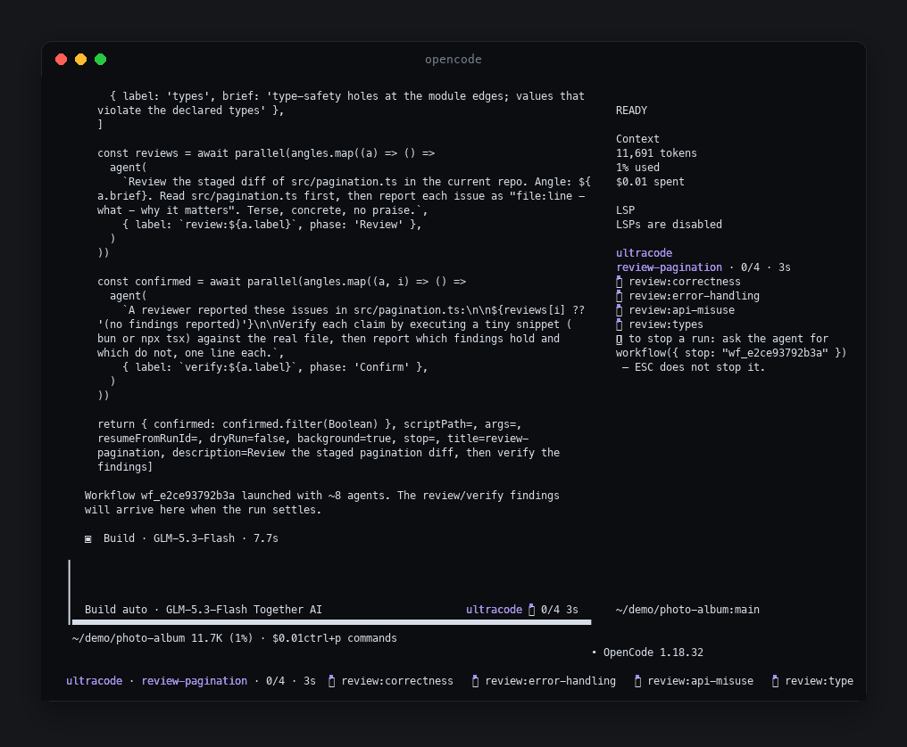
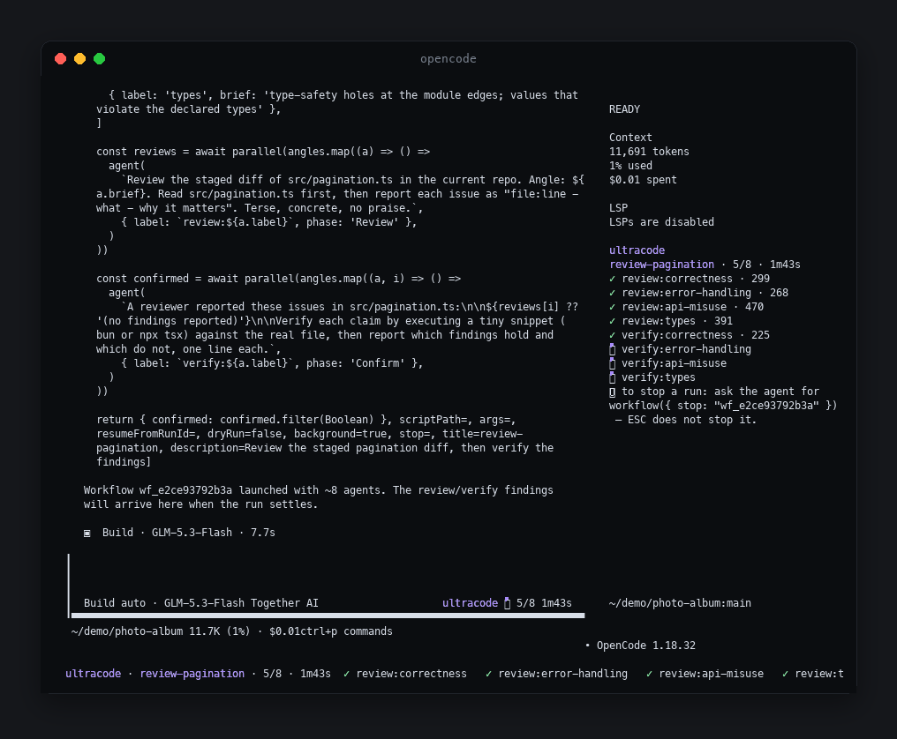
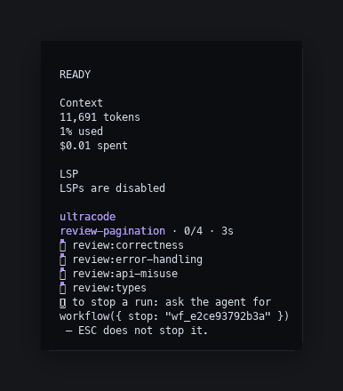
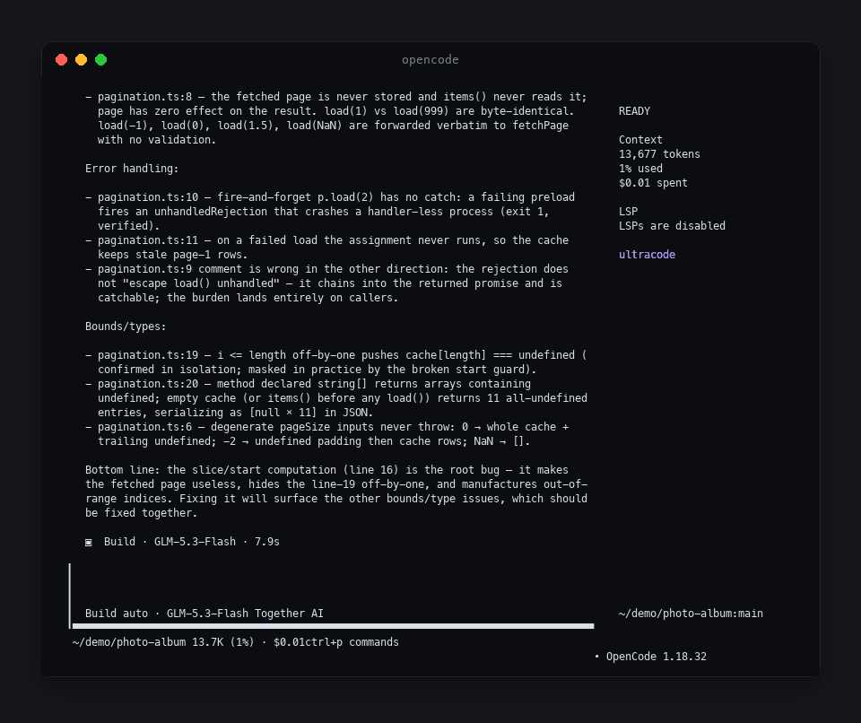

<div align="center">


# ultraopen

Deterministic multi-agent workflow orchestration and an `ultracode` effort mode for
[opencode](https://github.com/anomalyco/opencode) — the open-source AI coding agent that runs in
your terminal.

[](https://github.com/PhillipChaffee/ultraopen/actions/workflows/ci.yml)
[](https://coveralls.io/github/PhillipChaffee/ultraopen?branch=main)
[](https://github.com/PhillipChaffee/ultraopen/actions/workflows/security.yml)
[](https://github.com/anomalyco/opencode)

**Fan out many agents at once · validated results · resume instead of restarting**

[Install](#install) · [Authoring workflows](#authoring) · [Compatibility](#compatibility) · [Development](#development)

</div>

> [!TIP]
> **See it live.** `bash test/e2e/tui-dev.sh` starts opencode with the real TUI rendering —
> nothing here between you and the thing.

A workflow is a deterministic JavaScript driver in which `agent()` is the only nondeterministic
call. Control flow — fan-out, loops, dedup, thresholds, early exit, synthesis — is real code, so
runs are reproducible and resumable: resume a failed run and the agents that already finished
replay from the journal instead of running — and billing — again.

```javascript
export const meta = {
  name: 'review-changes',
  description: 'Review changed files across dimensions, verify each finding',
  phases: [{ title: 'Review' }, { title: 'Verify' }],
}

const results = await pipeline(
  DIMENSIONS,
  d => agent(d.prompt, { phase: 'Review', schema: FINDINGS }),
  review => parallel(review.findings.map(f => () =>
    agent(`Adversarially verify: ${f.title}`, { phase: 'Verify', schema: VERDICT })
  )),
)

return { confirmed: results.flat().filter(Boolean) }
```

<a id="how-it-works"></a>

## 🎬 What a run looks like

Real captures from the live TUI — the same machinery the e2e suites drive — re-themed in
presentation only.

**1. Hand the model the script; the engine fans out instantly.** The tool call returns at once
with a `<workflow-launched>` handle — the run executes in the background — and four review agents
spawn in parallel: the bottom strip gains one row per agent, the sidebar fills in, and
`ultracode ⠋ 0/4` appears beside the input. (The transcript also echoes the raw `workflow` call —
an upstream renderer quirk, and exactly why the progress surfaces exist.)



**2. The run keeps working.** Two minutes in, the four reviewers have reported (green rows, token
counts) and a second wave is verifying their findings by execution — real model calls, real file
reads. You keep chatting; the run outlives the turn that launched it.



**3. Up close: the sidebar panel.** Opened with `Ctrl-x` then `b` — one summary line per run,
one row per agent, glyphs for state.



**4. The findings arrive on their own.** When the run settles, a `<workflow-completed>`
notification is delivered into the transcript — no polling asked for — and the model reports
what the run confirmed: here, concrete findings on a staged demo diff, from an uncaught fetch to
an off-by-one loop in `src/pagination.ts`.



Agents show as `⠋` running, `✓` done, `✗` failed. All three surfaces (strip, sidebar, prompt
status) are served by one shared poller — one directory pass per second — so having them all
open costs one read. The surfaces update imperatively (`node.content` + `requestRender()`) to
work around an upstream 1.18.x rendering limitation; `src/tui/index.tsx` documents the
constraint.

<a id="why"></a>

## 🤔 Why ultraopen

opencode can already spawn subagents. The trouble is orchestration by prompting: ask one model to
fan out and you get a nondeterministic pile of parallel turns — different every run, unreadable in
review, and lost the moment a turn stalls. ultraopen makes the fan-out a script: short enough to
read in one screen, diffable in review, and replayable after a crash. This is not a framework —
no DSL, no server process, nothing to deploy; the orchestration layer is plain JavaScript that
runs inside the coding agent you already use.

| | Ad-hoc prompt fan-out | Orchestration frameworks | ultraopen |
| --- | --- | --- | --- |
| Orchestration lives | in the model's head | a graph DSL plus a server | plain JS, inside your agent |
| Runs are reproducible | every run differs | deterministic | deterministic — same script, same flow |
| Recover from a crash | start over | varies | resume; finished agents replay instantly |
| Reviewable | no | partially | the script is a diff like any other |
| Cost to start | none | a new runtime and concepts | a plugin you already installed |

If you need cross-language runtimes, hosted memory, or a standalone server, use a framework.
ultraopen only tries to be the right tool when the work already happens in opencode.

<a id="features"></a>

## ✨ What you get

- **`workflow` tool** — runs a JavaScript script that fans out across parallel subagents,
  background by default: the tool returns the run id at once and the run continues detached.
  Blocking is one option flip (see [Install](#install)).
- **`workflow_status` tool** — reads one run's live state from disk — status (`running`,
  `completed`, `failed`, `cancelled`, `orphaned`), phase, agent counts, token total,
  `budget { total, spent }`, last logs, and once settled the final value or the failure text. A
  `wait` blocks one call up to 300 s instead of polling. Read-only, cross-process, crash-safe:
  the run directory is the source of truth.
- **Notifications, not polling** — a background run's outcome is delivered, not requested: the
  `<workflow-completed>` or `<workflow-failed>` message lands in the conversation when the run
  settles. Mechanics below.
- **Stop and auto-resume** — `workflow({ stop })` cancels a detached run; a run its process
  interrupted auto-resumes on the next start. Mechanics below.
- **Saved workflows** — a directory of named scripts runs by name: `workflow('deploy-check')`
  inside any script, one `/workflow-<name>` command per saved file, and `/workflow-resume
  <runId>` to replay a past run. Defaults: `<config>/ultraopen/workflows` and the project's
  `.opencode/ultraopen/workflows` (which wins on a name collision); `workflowPaths` adds more.
- **Schema-forced output** — `agent(prompt, { schema })` returns a validated object; invalid
  output retries up to three attempts in the same session.
- **Resume** — `resumeFromRunId` replays unchanged calls instantly; the first edited call and
  everything after it in the same scope runs live. Failed runs keep their partial journal, so a
  resume only redoes the unfinished work.
- **`ultracode` mode** — raises reasoning effort and makes fan-out the default. Four ways in:
  the `ultracode` agent, the keyword, `/ultracode`, or a project config flag. The keyword is
  one-shot by default — a filename mention (`src/ultracode.ts`) never triggers at all
  (`keywordBehavior` flips it — see [Install](#install)).
- **Safety rails** — a recursion guard (a nested `workflow()` runs one level only), a per-agent
  inactivity deadline plus wall-clock ceiling, a global concurrency cap, an orphan reaper,
  retention pruning of finished run directories, and a large-run advisory — advice only, nothing
  stops (numbers in the limits table below).
- **Run control (in progress)** — `stop` is live (above); a run's directory also accepts
  `control.jsonl` commands: `pause` and `resume` gate new agents while in-flight work finishes,
  `stop-run` and `stop-agent` abort the run or one child, and `restart-agent` is parsed but not
  implemented yet. TUI keys for selection/restart and the drill-down view are the next slice.
- **Approval prompt** — the prompt names the real workflow (not the ignored title), its
  description and phases, the run id, and the projected agent count. The script is persisted to
  the run directory **before** the prompt appears, so you can open `<run dir>/script.js` and
  read exactly what will run before approving. `always` is scoped per workflow name.

### The launch contract

The `workflow` tool returns immediately with a `<workflow-launched>` result naming the run id and
directory — it never contains the outcome. In a long-lived host (TUI, `serve`, `web`, `acp`, the
`--mini` REPL) the result tells the model to end its turn once the run is launched and to poll
`workflow_status(runId, { wait })` when you ask about the run — you keep chatting while the run
works. In one-shot `opencode run` the process exits right after the turn, so the result instead
keeps the turn alive: the model polls until the run settles — an unsettled run dies with the
process (its completed agents survive on disk and a later `resumeFromRunId` replays them). Old
synchronous behavior: `"runMode": "blocking"` or env `ULTRAOPEN_WORKFLOW_SYNC=1`; `dryRun` always
waits.

How many runs one session may hold is ultracode-conditional — policy and rationale in
[docs/adr/0001-launch-concurrency-policy.md](./docs/adr/0001-launch-concurrency-policy.md): a
non-ultracode session holds exactly one live run; an ultracode-active session holds up to
`ultracodeMaxRuns`, and finishing any run frees a slot. Saying
"don't fan out" changes the standing guidance, never the gate; `dryRun` is exempt; resuming a
still-executing run is refused — two engines would write one journal.

**Stopping a run.** Interrupting the turn (ESC) never stops a background run — the launch result
says so, and the sidebar carries the same hint: to stop a detached run, call
`workflow({ stop: "<runId>" })`. Its subagents abort, the run is recorded `cancelled`, a
`<workflow-stopped>` confirmation hydrates into the run's session, and no completion
notification follows — a run you stopped must never appear to have finished on its own. A run
owned by another process must be stopped from that session, and a stop call that cannot act
returns a clear refusal.

**The notification.** When a detached run settles, the outcome is delivered to the run's
session: a synthetic message wrapping the same render the blocking result carries, capped at
4096 characters (cut at a line boundary) with a pointer line to the full `result.json` or
`failure.txt`. If the turn ended exactly as the notification landed, one idle nudge re-fires it
— once per run, ever. While the run is live, each turn also carries an ephemeral one-line
reminder naming the run id, the workflow, and its elapsed time — what keeps the model from
duplicating work already in flight.

**Auto-resume.** A detached run survives process death up to its journal: on the next start,
runs the dead process interrupted re-execute automatically under the same run id — completed
agents replay from the journal, the missing tail re-runs, and the original session is hydrated
with the outcome. Guards keep it bounded: the interruption must be younger than
`autoResumeTtlHours`, at most `autoResumeMax` runs adopt per boot, oldest first, a run stopped
by request never resumes, and the stored args must still hash to the run's manifest.

| Global | Behavior |
| --- | --- |
| `pipeline(items, ...stages)` | streams items through stages with no barrier; a stage gets `(prev, item, index)` |
| `parallel(thunks)` | a barrier over an array of thunks; a failing thunk becomes `null` |
| `agent(prompt, opts?)` | spawns a subagent; returns a validated object with `{ schema }`, `null` if nothing usable |
| `phase(title)`, `log(msg)` | progress narration |
| `budget` | `{ total, spent(), remaining() }` output-token ceiling |
| `args` | the tool call's `args` value, verbatim — the script sees exactly what was passed |
| `workflow(...)` | launches a nested run — one level deep, sharing the family budget |

<details>
<summary>Engine limits and agent options</summary>

| Limit | Value |
| --- | --- |
| Agents per run | 1,000 |
| Items per `pipeline`/`parallel` call | 4,096 |
| Script size | 512 KiB (524,288 characters) |
| Concurrency | 1–32 (default 8) |
| Per-agent inactivity limit | 5 min without progress (resets on any child event) |
| Per-agent wall clock | 4 h default, `0` disables |
| Stall auto-restart | up to 3 restarts per agent after an idle-limit kill; a wall-clock kill never restarts |
| Large-run advisory | ≥ 20 scheduled agents or ≥ 500k projected output tokens |
| Retention | finished run directories pruned after 30 days |

`agent()` accepts `label`, `phase`, `schema`, `model`, `effort`, `agentType`, `isolation`,
`disallowedTools`.

</details>

<a id="install"></a>

## 📦 Install

1. Build:
   ```bash
   bun install && bun run build
   ```
2. Reference it from both config files — the same `plugin` array in each. TUI plugins are read
   only from `tui.json`; `opencode.json`'s `plugin` array never reaches the TUI runtime.
   ```jsonc
   // opencode.json and tui.json, both:
   { "plugin": ["/absolute/path/to/ultraopen"] }
   ```
   That's it — opencode loads the plugin on next start.
3. An absolute path is classified as a file plugin, which skips the version-compatibility gate,
   so there is no publish step while iterating.
4. Options go through the tuple form — never a new top-level key, which opencode hard-rejects:
   ```json
   { "plugin": [["/path/to/ultraopen", { "concurrency": 8, "ultracode": true }]] }
   ```

| Option | Default · meaning |
| --- | --- |
| `concurrency` | 8 — global cap on live agents; clamped 1–32, `0` rejected |
| `ultracode` / `mode: "ultracode"` | off — enable the `ultracode` effort mode |
| `ultracodeMaxRuns` | 8 — live runs an ultracode-active session may hold; clamped 1–32. Non-ultracode sessions always hold one |
| `agentDeadlineMs` | 4 h — wall-clock ceiling per agent; `0` disables (the wall clock only bounds pathology) |
| `agentIdleMs` | 5 min — inactivity limit per agent, reset on child progress. Stalled agent: killed at the limit, restarted up to 3 times |
| `keywordBehavior` | `"one-shot"` — a plain `ultracode` mention fans out only that task; `"session"` keeps the mode on |
| `budgetTokens` | unset — output-token ceiling per launch: one launch and its nested runs share the family ceiling; concurrent launches each hold their own (N live runs can spend N × ceiling). Reached: further `agent()` calls throw and the run fails. Unset or invalid = uncapped |
| `sizeGuideline` | unset — size advice appended to the tool description (the same channel as Claude Code's size guideline) |
| `effortPreference` | `["xhigh", "max", "high", "medium", "low"]` — the effort ladder tried in order |
| `runMode` | `"background"` — the launch contract (see above); `"blocking"` waits for the final result. Env `ULTRAOPEN_WORKFLOW_SYNC=1` forces blocking |
| `largeWorkflowAgents` | 25 — projected-agent count at which a launch is flagged "Large workflow: ~N agents projected". Advisory only |
| `autoResume` | on — re-execute interrupted background runs on the next start; stopped runs never resume. `false` restores manual-resume-only |
| `autoResumeTtlHours` | 24 — how long an interrupted run stays worth auto-resuming; older runs stay hand-resumable until retention prunes them |
| `autoResumeMax` | 1 — interrupted runs may auto-resume per boot, oldest first |
| `workflowPaths` | — — extra saved-workflow directories, added between the two defaults |

The plugin also installs permission defaults — `workflow` asks, `workflow_status` is allowed —
and ships the workflow-authoring skill (see [Authoring workflows](#authoring)).

<a id="authoring"></a>

## 📖 Authoring workflows

The full authoring reference lives in this repo at
[skills/workflow-authoring/SKILL.md](./skills/workflow-authoring/SKILL.md): the globals table,
the engine-enforced rules (pure-literal `meta` first, `Date.now()`/`Math.random()` rejected at
parse time, `dryRun: true` for a free shape check), composable patterns (adversarial verify,
judge panels, loop-until-dry), the run-directory layout (`journal.jsonl` per run), and
debugging/resume notes. It ships inside the installed package too, so the model driving your
workflow sees the same reference.

<a id="compatibility"></a>

## 🧭 Compatibility and known limits

Verified against opencode 1.18.31 by the live e2e suites (`test/e2e`). The full working,
known-gap, and cosmetic inventory — each probe with its implementation note — lives in
[docs/compatibility.md](./docs/compatibility.md). Headline gaps:

- `agent()`'s `isolation: "worktree"` option is inert in the live wiring — ours to wire, not
  upstream (`worktreeRoot` is never passed).
- Schema-forced agents (`schema:` on `agent()`) can fail against Together with an empty
  `APIError` when ANY tool in the session's toolset carries a `$ref` in its JSON Schema
  (workarounds in the doc).
- The TUI hides synthetic user messages from the timeline (upstream 1.18.x), so a completion
  notification never shows as its own row — the turn it starts is what you see.

<a id="development"></a>

## 🛠️ Development

```bash
bun run check   # lint + strict typecheck + tests (95% coverage gate) + Node parity
bun run m0      # provider smoke test against a live model

bash test/e2e/technical.sh   # live end-to-end: real opencode processes, real model calls
bash test/e2e/visual.sh      # live TUI in tmux: all three progress surfaces, permission flow
bash test/e2e/tui-dev.sh     # run `opencode` locally with the TUI plugin actually rendering
```

The e2e suites run in an isolated scratch XDG home (real provider auth, throwaway state) and
assert on the plugin's own on-disk run artifacts plus captured tmux panes. They make real model
calls — pennies per run on Together, on the default suite model (override with `E2E_MODEL`).
Measured flake rate: zero flake events in one clean run of both suites — bad weather is
unmeasured, but the watchdog plus per-case retry bound it, and both suites retry the common
cases. The screenshots at the top are rendered from `visual.sh` frame captures (see `assets/`).

`tui-dev.sh` exists because of a dev-checkout trap: the TUI host injects its own Solid/OpenTUI
into a plugin only when the plugin directory cannot resolve them, and `node_modules/solid-js`
ships Solid's SSR build — signals never update, so the surfaces silently render nothing. A dev
checkout must stash the shadowing packages (the wrapper does it for you); a published install is
unaffected.

`bun run m0` is a re-runnable health check for the one interaction that cannot be verified from
source: that `format: {type:"json_schema"}` works together with a high reasoning variant, and
that forced tool choice still leaves an agent free to research first — a path upstream has no
test coverage for, so it can regress silently in an opencode release.

CI runs lint, typecheck, the coverage-gated tests, and Node parity on ubuntu and macOS. The
**Coverage Status** badge is the percentage Coveralls computes from each coverage-gated run
(free for public repos, no secret to set); **Security** is a weekly zizmor audit of the workflow
files themselves.

## ⚖️ License

MIT — see [LICENSE](./LICENSE). Attribution for the adapted workflow tool description lives in
[NOTICE](./NOTICE).